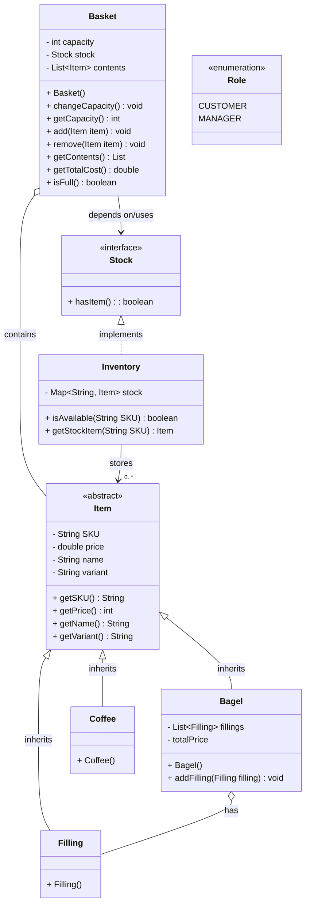

# Domain Model

| Classes       | Members                    | Methods                         | Scenario                                                             | Output                                         |
| ------------- | -------------------------- | ------------------------------- | -------------------------------------------------------------------- | ---------------------------------------------- |
| ``Basket``    | ``int capacity``           | ``changeCapacity()``            | MANAGER Role tries to change the basket capacity                     | Capacity is changed.                           |
|               |                            |                                 | CUSTOMER Role tries to change the basket capacity                    | Capacity remains unchanged.                    |
|               |                            | ``isFull()``                    | CUSTOMER wants to check if their basket is at capacity or not.       | true/false                                     |
|               | `List<Item> contents`      | ``add(Item item)``              | CUSTOMER tries to add an Item that does not exist in the Inventory.  |                                                |
|               |                            |                                 | CUSTOMER adds an Item that exists in the Inventory.                  |                                                |
|               |                            | `remove(Item item)`             | CUSTOMER removes an Item from their Basket.                          | Item is removed from Basket.                   |
|               |                            |                                 | CUSTOMER tries to remove an Item that isn't in the Basket.           | String "There is no such item in your basket." |
|               |                            | ``getTotalCost()``              | CUSTOMER wants to know the total cost of everything in their Basket. | double                                         |
| ``Item``      | ``String SKU``             |                                 |                                                                      | String                                         |
|               | ``double price``           | ``getPrice()``                  |                                                                      | double                                         |
|               | ``String name``            |                                 |                                                                      | String                                         |
|               | ``String variant``         |                                 |                                                                      | String                                         |
| ``Bagel``     | ``List<Filling> fillings`` | ``addFilling(Filling filling)`` | CUSTOMER wants to add a Filling to their Bagel.                      | Filling is added to list of fillings.          |
|               |                            | ``getTotalCost()``              | CUSTOMER wants to know the total cost of a Bagel, with Fillings.     |                                                |
| ``Filling``   |                            |                                 |                                                                      |                                                |
| ``Inventory`` | ``List<String> skus``      | ``isAvailable(String SKU)``     |                                                                      |                                                |
| ``Role``      | ``CUSTOMER``               |                                 |                                                                      |                                                |
|               | ``MANAGER``                |                                 |                                                                      |                                                |
#### Random thoughts
- For the inventory, a Map is probably a good idea. We map each SKU to an int, to keep track of the stock.
	- Not <Item, int> because the Items are not unique
	- Or each Item could keep track of how many are left in stock? But then addFilling() wouldn't really work...
	- We don't actually need to keep track of stock right now, so let's skip it and just have a list with the SKU's
# Class diagram



# Extensions
## Extension 1: Discounts
### User Stories
```
1.
As a customer,
To save some money on my breakfast,
I'd like to be able to buy a Coffee & Bagel combo deal.
```

```
2.
As a customer,
With an extreme love for bagels,
I'd love to get a discount when I buy a whole lot of bagels at the same time.
```

```
3.
As a manager,
Who loves to make money,
Fillings still cost the extra amount per bagel.
```

```
4.
As a customer, 
Who of course likes big discounts,
I would like the discount applied to be the greatest possible.
```
